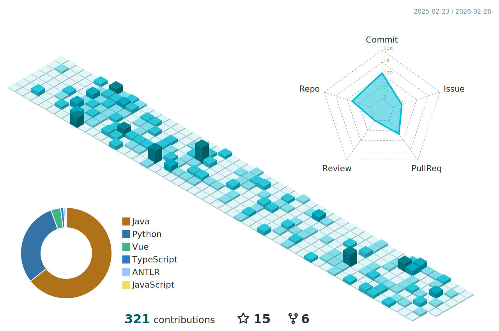

  <h2>Hi there, I'm <a href="https://github.com/Cyanty">Cyanty</a> 👋</h2>

  <h4>
    <em>
    "Writing code is the closest thing we have to superpowers. Do it for fun." 
    </em>
  </h4>

  

     Coding for Fun · Open Source Enthusiast · Life Long Learner
  

<!-- ICONS

	
    
	
    

-->

  <picture>
    <source media="(prefers-color-scheme: dark)" srcset="./profile-3d.svg">
    <source media="(prefers-color-scheme: light)" srcset="./profile-3d.svg">
    
  </picture>

  

